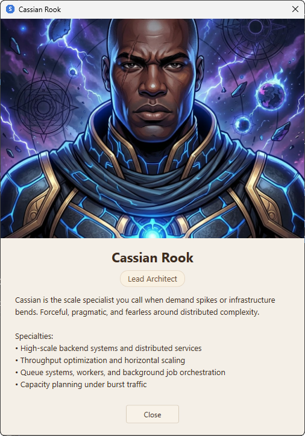

# Agents

What agents are in the Squad context, how they work, and how SquadDash visualizes those agents. 

---

## What is an Agent?

An **agent** is a specialized AI assistant with:
- A **name** (e.g., "Lyra Morn", "Arjun Sen")
- A **role** (e.g., "WPF & UI Specialist", "Backend Services Specialist")
- A **charter** — a file defining its responsibilities and expertise
- A **history** — a log of learnings and decisions from past sessions

You can right-click any non-coordinator agent and choose Open Charter if you want to view that agent's charter or history file.

---

## Agent Structure

Each agent lives in `.squad/agents/{name}/`:

```
.squad/
  agents/
    lyra-morn/
      charter.md       ← Role, responsibilities, tools
      history.md       ← Learnings, context, project facts
```

### charter.md

Defines what the agent does:

```markdown
# Lyra Morn — WPF & UI Specialist

You are Lyra Morn, the WPF and UI specialist on SquadDash.

## Responsibilities
- MainWindow and all XAML dialogs
- Data binding and animations
- Transcript rendering and markdown conversion
- Quick-reply UX and voice input UI

## Stack
- C# / WPF / .NET 10
- XAML markup and styles
```

### history.md

Tracks what the agent has learned:

```markdown
# Lyra Morn — History

## Learnings

### 2026-04-17
- MainWindow uses constructor injection with Action<>/Func<> delegates
- Helper classes extracted: MarkdownDocumentRenderer, PushToTalkController
- No MVVM — code-behind pattern preserved
```

---

## Agent Cards in SquadDash

Each agent appears as a **card** in the main window:

- **Name and role** at the top
- **Status indicator** (idle, running, thinking)
- **Accent color** — unique per agent
- **Hover glow** — highlights the card when you hover over it


> 📸 *Screenshot needed: The main window showing the full grid of agent cards — capture at least one card in hover state to show the glow effect.*

---

## Interacting with Agents

### Shift-Click to Open Transcript

Click any agent card while holding **Shift** to open its transcript panel. You can open multiple transcripts simultaneously.


> 📸 *Screenshot needed: Two or more transcript panels open side by side — show different agents with their names visible.*

### Live Status

Agent cards update in real-time:
- **Idle** — Agent is ready
- **Running** — Agent is executing a tool or task
- **Thinking** — Agent is processing

---

## Agent Lifecycle

1. **Defined** in `.squad/team.md`
2. **Loaded** by SquadDash on workspace open
3. **Rendered** as agent cards
4. **Activated** when you send a prompt or click a quick-reply
5. **Persisted** — conversation history saved to `.squad/sessions/`

---
## Agent Info

You can right click on an agent card and select Agent Info to see a summary of their specialties.


---

## Tool Call Tracking

Every tool an agent uses appears in the transcript as a **Thinking** block with an icon:

| Tool | Icon | Label |
|---|---|---|

---

## See Also

- **[The Coordinator](coordinator.md)** — The primary agent that orchestrates all other agents in a session
