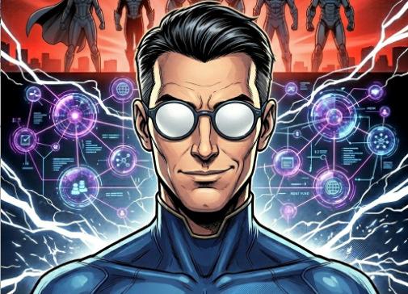
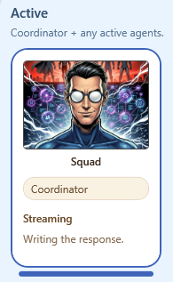
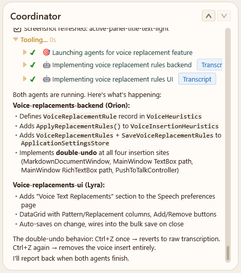

# The Coordinator

The Coordinator is the primary AI agent in a SquadDash session. It is the default agent — every prompt you send goes to the Coordinator first, unless you explicitly target a specialist.

See [Agents](agents.md) for how individual agents work.

---

## What Is the Coordinator?

The Coordinator is the agent that:

- **Receives every user prompt** by default
- **Decides how to handle it** — directly, or by delegating to one or more specialist agents
- **Reports results back** in a coherent, synthesised response

It is always present, regardless of whether a squad team is configured.

---

## Agent Orchestration

When a squad team is configured, the Coordinator's primary job is orchestration — not implementation.

When you send a prompt, the Coordinator:

1. **Reads your request** and determines what kind of work is involved
2. **Consults `.squad/routing.md`** to find routing rules for this type of work
3. **Consults `.squad/team.md`** to identify which specialist agents are available
4. **Delegates** to the appropriate agent(s) — one agent for focused tasks, or multiple agents in parallel for broader requests
5. **Monitors** the launched agents as they run
6. **Synthesises results** and reports back to you

This fan-out pattern lets the Coordinator coordinate parallel workstreams — for example, asking a backend specialist and a UI specialist to work on separate parts of a feature simultaneously.

---

## The Coordinator Transcript

The Coordinator has its own transcript pane. It is the **primary transcript**:

- Displayed below the agent cards and to the left of any other visible transcripts
- **Shown by default** when no other agent transcript is selected
- Contains all orchestration messages — delegation decisions, handoff notes, and result summaries

You can shift-click any specialist agent card to open its transcript alongside the Coordinator's. See [Transcripts](transcripts.md) for more on the multi-transcript panel system.

---

## Working Solo vs. With a Team

The Coordinator's behaviour depends on whether a squad team is configured.

### No team configured

When there is no `.squad/team.md` in the workspace, the Coordinator handles all work directly. It acts as a general-purpose AI assistant — answering questions, writing code, running tools, and doing whatever the task requires.

### Team configured

When a team is present, the Coordinator shifts into a **manager role**. It delegates implementation, investigation, and testing to the right specialist agents and synthesises their results back to you. Direct implementation by the Coordinator is the exception rather than the rule.
You can create a team by using the /hire command.

---

## When the Coordinator Does Work Itself

Even with a team configured, the Coordinator handles certain tasks directly:

- **Quick factual answers** — questions that don't require investigation or code changes
- **Trivial tasks** — one-liners, clarifications, or simple lookups
- **Explicit requests** — when you ask the Coordinator specifically to handle something
- **No matching specialist** — when no agent in the roster has a charter that matches the task

In all other cases, the Coordinator delegates to the most appropriate specialist.

---

## Summary

| Scenario | Coordinator behaviour |
|---|---|
| No squad team | Handles everything directly |
| Team configured, specialist matched | Delegates to specialist(s) |
| Team configured, no match | Handles directly |
| Quick factual answer | Handles directly |
| User targets Coordinator explicitly | Handles directly |
