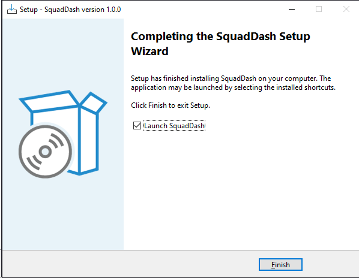
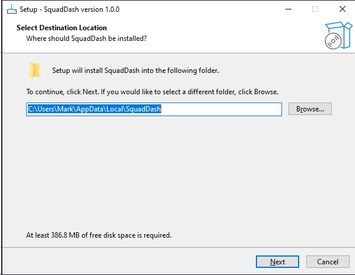
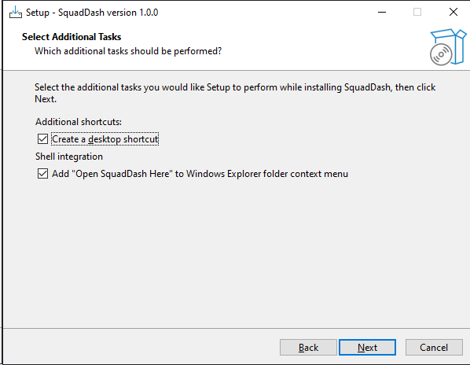
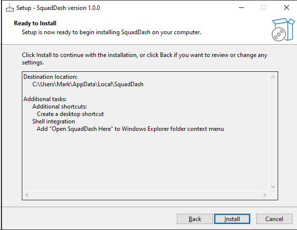

# Installing SquadDash

SquadDash ships as a standard Windows installer (`.exe`). The steps below walk you through downloading and running it for the first time.

---

## System Requirements

| Requirement | Minimum |
|---|---|
| **OS** | Windows 10 (21H2) or Windows 11 |
| **.NET Runtime** | [.NET 10 Desktop Runtime](https://dotnet.microsoft.com/download/dotnet/10.0) |
| **Node.js** | 18 or later (required for Squad CLI) |
| **Architecture** | x64 |

> **Note:** The installer checks for the .NET 10 Desktop Runtime at launch and will warn you if it is missing. You can install the runtime from [https://dotnet.microsoft.com/download/dotnet/10.0](https://dotnet.microsoft.com/download/dotnet/10.0) before or after running the SquadDash installer — the app will not start without it.

Node.js is required for the Squad CLI that SquadDash manages on your behalf. If Node.js is not installed, SquadDash can still launch but workspace initialisation and CLI features will be unavailable.

---

## Download

Head to the [GitHub Releases page](https://github.com/bradygaster/SquadDash/releases) and download the latest `SquadDash-Setup-x.x.x.exe` asset from the most recent release.

### WinGet (experimental)

WinGet support is in progress. Once published you will be able to install with:

```powershell
winget install SquadDash
```

This is not yet available in the stable WinGet repository — check the Releases page in the meantime.

---

## Running the Installer

### 1. Launch

Double-click the downloaded `.exe` to start the installer. Windows SmartScreen may show an "Unknown publisher" warning on first run — click **More info → Run anyway** to proceed.

The welcome screen confirms the version you are installing.



Click **Next** to continue.

---

### 2. Choose Install Location

The installer defaults to `%LOCALAPPDATA%\Programs\SquadDash`. You can change this to any location where your user account has write permission.



Click **Next** when you are happy with the location.

---

### 3. Select Additional Tasks

This screen lets you opt in to shell integration extras:

- **Add "Open SquadDash Here" to folder context menu** — Adds an entry to the right-click menu on folders in File Explorer, letting you open SquadDash directly in that workspace.
- **Create a Start menu shortcut** — Checked by default.
- **Create a Desktop shortcut** — Optional.



Choose the options you want and click **Next**.

---

### 4. Ready to Install

The installer summarises your choices. Click **Install** to begin copying files.



Installation typically completes in under 30 seconds. A progress bar tracks the file-copy step.

When the final screen appears, click **Finish**. SquadDash will launch automatically unless you uncheck the "Launch SquadDash" option on that screen.

---

## After Installation

- **Start menu** — SquadDash appears under *All apps* as **SquadDash**.
- **Context menu** — If you selected the shell integration option, right-clicking any folder in File Explorer shows **Open SquadDash Here**. This opens SquadDash with that folder as the active workspace.
- **First launch** — On the very first run, SquadDash opens a folder picker so you can choose (or confirm) your workspace directory. This is the root of the repository where your `.squad/` team configuration lives.

---

## Updating

To update to a newer version, download the latest installer from the [Releases page](https://github.com/bradygaster/SquadDash/releases) and run it over your existing installation. The installer detects the previous version and upgrades in place.

**Your settings and workspaces are preserved.** The upgrade does not touch `%APPDATA%\SquadDash` (where preferences and session data are stored) or any `.squad/` directories inside your repositories.
