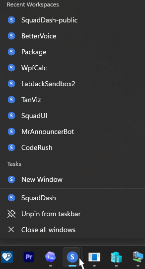
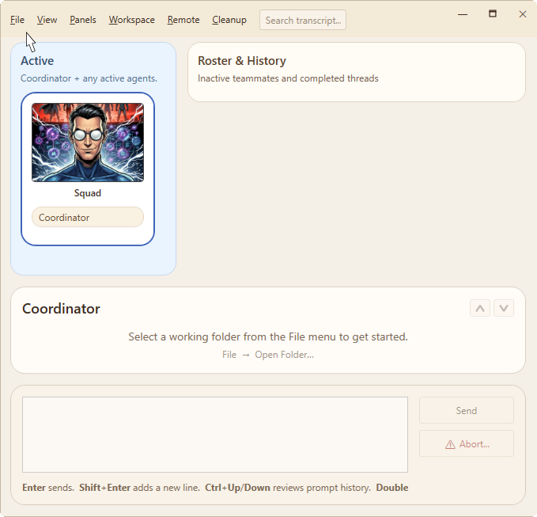

# Starting from the Windows Taskbar.

If you pin SquadDash to the Windows taskbar, you can right-click that icon and select the folder you want to start from from the **Recent Workspaces** MRU list.

You can also choose "New Window" to open up SquadDash in a new folder.

When a new SquadDash window opens, use the **File** menu to select your working folder. You can choose an existing project folder or an empty folder to start a new project.

