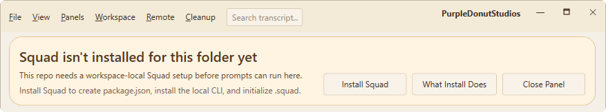
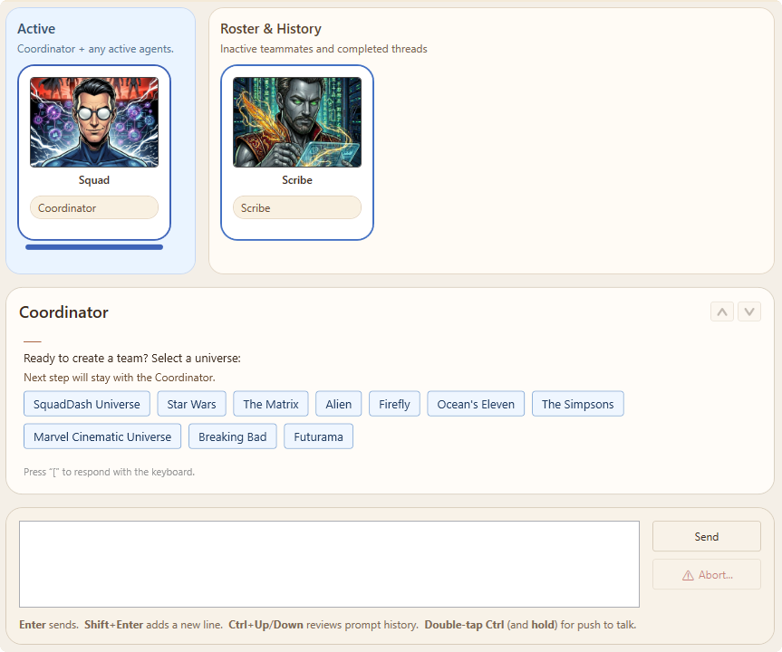

# First Run

What happens when you launch SquadDash for the first time, and how to connect to a workspace.

---

## Launching SquadDash

Run:

```bash
dotnet run --project SquadDash
```

Or from Visual Studio: **F5**.

---

## First Launch Flow

### 1. Node.js Check

SquadDash verifies that `node`, `npm`, and `npx` are accessible on your `PATH`. If any are missing, you'll see an error dialog.

**Fix:** Install Node.js LTS and restart SquadDash.

---

### 2. Workspace Selection

You can specify a workspace folder via command line (in quotes) or you can open a workspace folder from the File menu. This is any directory where you want Squad to run — typically a Git repository.

**What SquadDash Does:**
1. Checks if `package.json` exists (creates one if not)
2. Installs the Squad CLI locally via `npm install`
3. Applies Windows compatibility fixes to the installed CLI
4. Runs `squad init` if `.squad/team.md` doesn't exist

---

### 3. Squad Initialization

If the workspace is not yet Squad-enabled, you'll see a message at the top with an option to **Install Squad**.


If you choose to install Squad, SquadDash runs:

```bash
squad init
```

This creates:
- `.squad/team.md` — Your AI team roster
- `.squad/routing.md` — Routing rules for work assignment
- `.squad/config.json` — Squad configuration

When basic configuration is complete, you'll be able to select the universe from which your team will be created. 



The blue quick-reply buttons at the bottom of the transcript let you choose the universe your team will originate from. If you select the **SquadDash Universe**, SquadDash will automatically use the built in artwork for each of the characters within that universe.


---

### 4. Main Window Appears

You'll see:
- **Agent cards** — One card per agent defined in `.squad/team.md`
- **Prompt input** — Type or use voice (double-Ctrl)
- **Top menu** — Workspace, Preferences, Trace


> 📸 *Screenshot needed: The full SquadDash main window — show all agent cards, the prompt input bar at the bottom, and the top menu.*

---

## Setting Up Your First Team

Edit `.squad/team.md` to define your agents. Example:

```markdown
# Squad Team

## Members

| Name | Role | Charter | Status |
|------|------|---------|--------|
| Alice | Backend Specialist | agents/alice/charter.md | active |
| Bob | Frontend Specialist | agents/bob/charter.md | active |
```

Create charter files in `.squad/agents/{name}/charter.md`:

```markdown
# Alice — Backend Specialist

You are Alice, the backend specialist. You handle API design, database schema, and server logic.
```

---

## Routing Configuration

Edit `.squad/routing.md` to define who handles what:

```markdown
# Work Routing

## Routing Table

| Work Type | Route To | Examples |
|-----------|----------|----------|
| API endpoints | Alice | REST routes, GraphQL resolvers |
| React components | Bob | UI components, styling |
```

See **[Routing](../reference/routing.md)** for full syntax.

---

## Opening Agent Transcripts

- **Shift-click** any agent card to open its transcript panel
- Multiple transcripts can be open simultaneously
- Live streaming shows tool calls and responses in real-time


> 📸 *Screenshot needed: Main window with one (or more) transcript panels open — show the transcript panel layout, tool call icons, and streaming response.*

---

## Voice Input (Optional)

To enable push-to-talk:

1. Open **Preferences** from the top menu
2. Enter your **Azure Cognitive Services Speech** key and region
3. Press **double-Ctrl** to activate voice input


> 📸 *Screenshot needed: The Preferences dialog — show the Azure Speech Key and Region fields.*

---

## Next Steps

- **[Agents](../concepts/agents.md)** — How agents work in Squad
- **[Squad Team](../concepts/squad-team.md)** — Team and routing model
- **[Documentation Panel](../concepts/documentation-panel.md)** — Browse docs inside SquadDash
